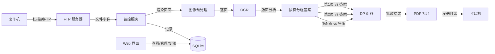

# 架构修正：多页 PDF = 多学生合订

## 一、问题分析

### 当前错误假设

* 1 个 PDF = 1 个学生的完整试卷

* OCR 结果全部合并后，统一与答案做一次 DP 对齐

### 实际场景

* 复印机可能一次扫描 N 份试卷，合为一个 N 页 PDF

* `301_2026-06-18_001.pdf` = 11 页 = **11 个学生各一页**

* 每页的字迹、答案都不同，但**所有学生做的是同一份默写题**

* 答案在每页独立存在（每页约 50 字、其中含答案对应约 30 字）

### 当前 Bug 的根因

当前在 `processor.py` 中将全部 11 页的 OCR 结果（537 字）合并后，一次性与答案（53 字）做 DP 对齐：

* 答案字散落在 11 页中 → 只对上了 53 个 → 484 个"多余字"全标错误

* 正确率仅 10% 但平均置信度 89.6%（OCR 本身识别不错，是比对策略错了）

### 修复思路

**每页独立与答案做 DP 对齐**：

```
第 1 页: ~50 字 vs 答案 53 字 → 对齐得 30 正确
第 2 页: ~50 字 vs 答案 53 字 → 对齐得 28 正确
...
第 11 页: ~50 字 vs 答案 53 字 → 对齐得 25 正确
汇总: 537 字中约 300+ 正确
```

***

## 二、架构变更

### 变更列表

| 文件                     | 变更类型     | 内容                             |
| ---------------------- | -------- | ------------------------------ |
| `架构设计.md`              | **文档**   | 数据流和文件名约定增加"多学生合订"说明           |
| `monitor/processor.py` | **修改**   | 按页分组后分别调用 `grade()`            |
| `core/grader.py`       | **可选优化** | 可支持分组 grade 辅助函数               |
| `web/app.py`           | **修改**   | 任务详情页增加"每页正确率"统计卡片             |
| `db/models.py`         | **不动**   | `result_json` 已有 `page` 字段，无需改 |

***

## 三、具体变更

### 3.1 `架构设计.md`

#### 3.1.1 文件名约定 → 增加"多页 = 多学生"说明

在现有 `{班级}_{日期}_{序号}.pdf` 描述后追加：

```markdown
> **多页 = 多学生合订**：一份 PDF 可能包含 N 页，每页是一个不同学生的独立答卷。
> 系统会按页分别批改，每页独立与答案做比对。
> {序号} 表示批号或扫描批次，不是学生编号。
```

#### 3.1.2 数据流图 → 增加"按页分组"步骤



#### 3.1.3 批次流程 → 增加"逐页批改"步骤

```markdown
## 批改流水线

1. **FTP 接收**
2. **文件稳定检测**
3. **PDF 渲染** — 按 DPI 200 渲染每页
4. **图像预处理** — CLAHE + 快速倾斜校正
5. **OCR 识别** — PaddleOCR 3.0 逐页
6. **版面分析** — 聚类分行 + 过滤印刷体
7. **✏️ 按页分组批改** — OCR 结果按 page 分组，每组*独立*与答案做 DP 对齐
8. **生成批注** — 在原 PDF 上叠加三色标记
9. **打印输出**
10. **归档**
```

***

### 3.2 `monitor/processor.py`

**改动 1**：OCR + 版面分析后，按 `page` 字段分组，每页独立 `grade()`

```python
# ── 当前 ──
student_answers = extract_student_answers(all_ocr_results, ...)
graded = grade(student_answers, answers)

# ── 改为 ──
student_answers = extract_student_answers(all_ocr_results, ...)

# 按页分组（每页是一个学生的独立答卷）
from collections import defaultdict
page_answers = defaultdict(list)
for r in student_answers:
    page_answers[r["page"]].append(r)

# 每页独立与答案做 DP 对齐
graded = []
for page_idx in sorted(page_answers.keys()):
    page_graded = grade(page_answers[page_idx], answers)
    graded.extend(page_graded)
```

**改动 2**：可观测性统计改为按页计算后加权平均

***

### 3.3 `web/app.py` — 每页统计卡片

在任务详情页（Tab 2），页面选择器下方新增"每页正确率"统计。

```python
# 在 page_sel 下方
if task.result_json:
    results = ...
    # 计算每页统计
    pages = sorted({r["page"] for r in results})
    page_stats = []
    for p in pages:
        p_results = [r for r in results if r["page"] == p]
        total = len(p_results)
        correct = sum(1 for r in p_results if r["status"] == "correct")
        page_stats.append({
            "页码": f"第 {p+1} 页",
            "字数": total,
            "正确": correct,
            "正确率": _fmt_pct(correct, total),
        })
    st.subheader("📊 每页统计")
    st.dataframe(pd.DataFrame(page_stats), use_container_width=True, hide_index=True)
```

***

## 四、风险 & 边界

| 场景        | 处理                                 |
| --------- | ---------------------------------- |
| 单页 PDF    | 按页分组后只有 1 组，行为完全不变                 |
| 某页 OCR 为空 | 跳过不 grade，stat=0                   |
| 答案 > 每页字数 | DP 自动补齐，多余的 expected 不产生 graded 条目 |
| 多班级混扫     | 不支持（文件名只有 1 个班级）                   |

***

## 五、验证

```bash
cd d:\MyCode\correction\auto_marker
# 旧试卷（1 页）→ 应无变化
python run_test.py --pdf 301_2025-03-20_001.pdf
# 新试卷（11 页）→ 正确率应 > 80%
python run_test.py --pdf D:\MyCode\correction\pictures\301_2026-06-18_001.pdf
```

预期：

* `301_2025-03-20_001.pdf`: 正确 ≈ 30/38 — **不变**

* `301_2026-06-18_001.pdf`: 正确从 53→**\~300+**（每页 \~30 正确 × 11 页）

