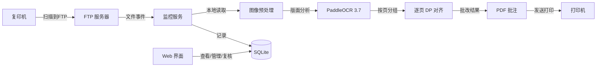

# 半自动批改台

复印机扫描 → FTP 接收 → PaddleOCR 识别 → 自动批改 → 打印输出。**老师只需放纸、按按钮、取卷子。**

## 系统架构



## 批改流水线

一次完整的批改经过 6 个阶段：

1. **FTP 接收** — 复印机上传 PDF 到 `data/incoming/`
2. **文件稳定检测** — 等待文件写入完成
3. **图像预处理** — CLAHE 对比度增强 + 快速倾斜校正（降采样检测）
4. **版面分析** — 聚类分行 + 过滤印刷体，只保留手写答案
5. **OCR 识别** — PaddleOCR 3.7 PP-OCRv6 Medium（中英文手写，×50 加速）
6. **动态规划对齐比对** — Needleman-Wunsch 算法 + 置信度门控
7. **生成批注** — 绿勾/橙三角/红圈叠加在原 PDF 上
8. **打印输出** — 发送到指定打印机
9. **归档** — 原始文件移至 `data/backup/`

## 目录结构

```
auto_marker/
├── ftp_server.py                # FTP 服务器（pyftpdlib）
├── monitor/
│   ├── watcher.py               # 文件监控 + 线程池队列
│   └── processor.py             # 流水线调度 + 可观测性
├── core/
│   ├── ocr_engine.py            # PaddleOCR 3.0 (PP-OCRv5_server)
│   ├── image_processor.py       # 图像预处理（CLAHE + 快速倾斜校正）
│   ├── layout_analyzer.py       # 版面分析（分行 + 答案提取）
│   ├── grader.py                # 动态规划对齐 + 置信度门控
│   ├── pdf_annotator.py         # 批注生成（红圈/绿勾/橙三角）
│   └── printer.py               # Windows 打印
├── db/
│   ├── models.py                # Task / Answer / ReviewCorrection
│   └── crud.py                  # 数据操作 + 复核 CRUD
├── web/
│   └── app.py                   # Streamlit 管理界面
├── config.ini                   # 全局配置
└── requirements.txt             # 依赖清单
```

## 快速开始

### 1. 安装依赖

```bash
pip install -r requirements.txt
```

### 2. 配置

编辑 `config.ini`，按需修改 FTP 端口、监控目录、打印机名称等。

### 3. 启动服务

**方式一：完整链路（推荐）**

```bash
C:\Users\yang\AppData\Local\Programs\Python\Python312\python.exe monitor/watcher.py        # 自动启动 FTP + 监控
```

**方式二：仅 Web 管理界面**

```bash
streamlit run web/app.py
```

**方式三：手动测试单份 PDF**

```bash
C:\Users\yang\AppData\Local\Programs\Python\Python312\python.exe run_test.py --pdf 301_2025-03-20_001.pdf
```

## 文件名约定

```
{班级}_{日期}_{序号}.pdf
```

| 文件名 | 含义 |
|--------|------|
| `301_2025-03-20_001.pdf` | 301 班，3 月 20 日，第 1 份 |

> **多页 = 多学生合订**：一份 PDF 可能包含 N 页（如 11 页），每页是一个不同学生的独立答卷。
> 系统自动按页分别批改，每页独立与答案做 DP 对齐比对。
> `{序号}` 表示批号（扫描批次），不是学生编号。

## 状态说明

| 状态 | 颜色 | 条件 |
|------|------|------|
| ✅ 正确 | 绿勾 | 字符匹配且置信度 ≥ 60% |
| ⚠️ 存疑 | 橙三角 | 字符匹配但置信度 < 60% |
| ❌ 错误 | 红圈 | 字符不匹配 |

## OCR 可观测性

每次批改自动记录：

- **平均置信度** — OCR 对所有识别字的平均置信度
- **低置信度字占比** — < 0.60 的字占总字数的比例
- **处理耗时** — 从加载到批注生成的总秒数
- **需人工复核** — 低置信度占比 > 30% 时自动标记

## Web 管理界面

4 个面板（Tab）：

- **📊 统计看板** — 指标卡片 / 可观测性 / 图表 / 按日汇总
- **📋 任务列表** — 筛选 / 详情 / 状态分布 / PDF 下载
- **✏️ 答案管理** — 保存 / 浏览 / 删除
- **⚙️ 系统配置** — 分字段表单

**人工复核**：在任务详情页勾选"开启人工复核模式"，可逐字修改状态，保存后自动记录到 `review_corrections` 表，可作为后续 OCR 模型微调的训练数据。

## 异常处理

| 场景 | 处理方式 |
|------|----------|
| 文件未写完 | 文件稳定检测超时则跳过 |
| 文件名不符合约定 | 移入 backup，跳过处理 |
| OCR 无结果 | 移入 failed |
| 打印失败 | 记录日志，不影响后续任务 |
| 答案未设置 | 跳过比对 |
| 低置信度 > 30% | 任务标记为 `needs_review`，待人工复核 |

## 性能指标

参考 `301_2025-03-20_001.pdf`（1 页，32 字答案）的实测数据：

| 阶段 | 耗时 |
|------|------|
| PDF 渲染 + 预处理 | ~5s |
| OCR 识别 | ~70s |
| 比对 + 批注 + 打印 | ~5s |
| **合计** | **~80s** |

OCR 是 CPU 模式下的主要瓶颈。如需进一步加速：
- 换 PP-OCRv5_mobile 模型（速度 ×3，精度略降）
- 启用 GPU 推理（`use_gpu=True`）

## 依赖

- Python ≥ 3.10
- pyftpdlib — FTP 服务器
- watchdog — 文件系统监控
- pdfplumber + PyMuPDF — PDF 读写
- reportlab — PDF 批注绘制
- paddleocr>=3.6.0,<4.0 + paddlepaddle>=3.2.1,<4.0 — OCR 引擎（PP-OCRv6 Medium）
- opencv-python — 图像预处理
- sqlalchemy — ORM
- streamlit — Web 管理界面

## 开发计划

- [x] PP-OCRv6 Medium 升级（×50 加速，+5.1% 精度）
- [x] 多学生合订 PDF 按页分组批改
- [x] 图像预处理（去噪/增强/校正）
- [x] 版面分析（分行 + 答案提取）
- [x] 动态规划对齐比对
- [x] OCR 可观测性 + 自动复核标记
- [x] 人工复核闭环（Web UI 改字 + 修正数据积累）
- [x] Streamlit Web 管理界面（4 Tab）
- [ ] LLM 形近字识别（"未/末"）
- [ ] 学情分析报表
- [ ] 微信/钉钉推送
- [ ] GPU 推理支持
