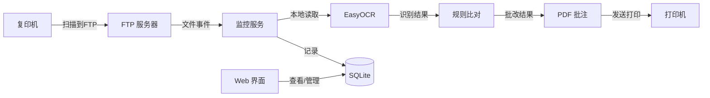

# 半自动批改台

复印机扫描 → FTP 接收 → OCR 识别 → 自动批改 → 打印输出。**老师只需放纸、按按钮、取卷子。**

## 系统架构



## 目录结构

```
auto_marker/
├── ftp_server.py           # FTP 服务器（pyftpdlib）
├── monitor/
│   ├── watcher.py          # 文件监控 + 线程池队列
│   └── processor.py        # 流水线调度
├── core/
│   ├── ocr_engine.py       # EasyOCR 引擎
│   ├── grader.py           # 规则比对
│   ├── pdf_annotator.py    # 批注生成（红圈/绿勾/橙三角）
│   └── printer.py          # Windows 打印
├── db/
│   ├── models.py           # SQLAlchemy 模型
│   └── crud.py             # 数据操作
├── web/
│   └── app.py              # Streamlit 管理界面
├── config.ini              # 全局配置
└── requirements.txt        # 依赖清单
```

## 快速开始

### 1. 安装依赖

```bash
pip install -r requirements.txt
```

### 2. 配置

编辑 `config.ini`，按需修改：

```ini
[ftp]
port = 2121
dir = ./data/incoming

[printer]
name =          # 打印机名称，留空为系统默认

[ocr]
# EasyOCR 首次运行会自动下载模型
```

### 3. 启动服务

**方式一：完整链路（推荐）**

```bash
# 启动监控（自动拉起 FTP 服务器）
python monitor/watcher.py
```

**方式二：分离部署**

```bash
# 终端 1：启动 FTP
python ftp_server.py --dir=./data/incoming

# 终端 2：启动监控
python monitor/watcher.py
```

**方式三：管理界面**

```bash
streamlit run web/app.py
```

## 文件名约定

复印机扫描上传的文件名必须符合以下格式，系统据此识别班级和任务：

```
{班级}_{日期}_{序号}.pdf
```

| 文件名示例 | 含义 |
|-----------|------|
| `301_2025-03-20_001.pdf` | 301 班，3 月 20 日，第 1 份 |
| `302_2025-03-20_001.pdf` | 302 班，3 月 20 日，第 2 份 |

## 批改流程

一次完整的批改流水线：

1. **FTP 接收** — 复印机上传 PDF 到 `data/incoming/`
2. **文件稳定检测** — 等待文件写入完成（大小/时间戳连续 3 次不变）
3. **入队处理** — 线程池（默认最大 4 并发）
4. **解析文件名** — 提取班级、日期、序号
5. **OCR 识别** — EasyOCR 逐页识别手写汉字
6. **规则比对** — 与标准答案比对，生成三态结果
7. **生成批注** — 在原 PDF 上叠加红圈/绿勾/橙三角
8. **打印输出** — 发送到指定打印机
9. **归档** — 原始文件移至 `data/backup/`

## 状态说明

| 状态 | 颜色 | 条件 |
|------|------|------|
| ✅ 正确 | 绿勾 | 字符匹配且置信度 ≥ 85% |
| ⚠️ 存疑 | 橙三角 | 字符匹配但置信度 60%~85% |
| ❌ 错误 | 红圈 | 字符不匹配或置信度 < 60% |

## Web 管理界面

Streamlit 界面提供三个面板：

- **任务列表** — 查看所有批改任务，按页查看每个字的识别结果
- **答案管理** — 按班级/日期设置标准答案
- **配置** — 在线编辑 `config.ini`

## 异常处理

| 场景 | 处理方式 |
|------|----------|
| 文件未写完 | 文件稳定检测超时则跳过 |
| 文件名不符合约定 | 移入 backup，跳过处理 |
| OCR 无结果 | 移入 failed |
| 打印失败 | 记录日志，不影响后续任务 |
| 答案未设置 | 从 answers.txt 读取，为空则跳过 |

## 依赖

- Python ≥ 3.10
- pyftpdlib — FTP 服务器
- watchdog — 文件系统监控
- pdfplumber + PyPDF2 — PDF 读写
- reportlab — PDF 批注绘制
- EasyOCR — 中文字符识别（自动下载模型）
- sqlalchemy — ORM
- streamlit — Web 管理界面

## 开发计划

- [x] 核心 OCR + 比对 + 批注流水线
- [x] 文件监控 + 线程池队列
- [x] 数据持久化 + Web 管理界面
- [ ] 多班级/多答案库
- [ ] LLM 形近字识别（"未/末"）
- [ ] 学情分析报表
- [ ] 微信/钉钉推送
