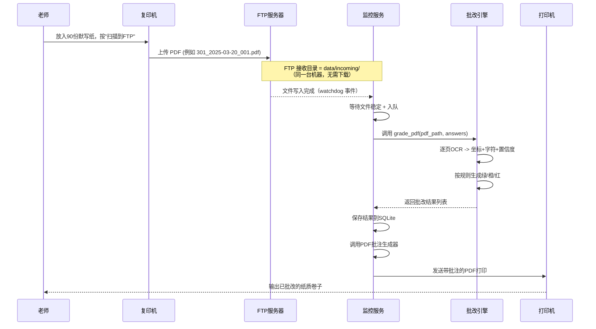

半自动批改台 - 系统架构设计

基于你已经跑通的 IV C3375 → FTP 服务器 链路，下面给出一个可直接落地的系统架构。核心原则：全自动、无人值守、低维护。

---

一、总体架构图

```mermaid
flowchart TB
    subgraph 硬件层
        A[复印机<br>IV C3375 带ADF]
        B[网络打印机<br>任意支持PDF的打印机]
    end

    subgraph 服务层 (一台常开PC或NAS)
        C[FTP服务器<br>pyftpdlib → ftp_server.py]
        D[监控服务<br>Python watchdog + 线程池队列]
        E[批改引擎<br>PaddleOCR + 规则比对]
        F[PDF批注生成器<br>pdfplumber + reportlab]
        G[打印服务<br>subprocess调用系统打印]
        H[任务数据库<br>SQLite]
    end

    subgraph 管理层
        I[Web管理界面<br>Streamlit]
        J[配置文件<br>answers.txt / config.ini]
        K[日志文件<br>便于追踪问题]
    end

    A -- 扫描到FTP --> C
    C -- 文件写入完成 --> D
    D -- 读取本地PDF --> E
    E -- 识别结果 --> F
    F -- 带批注PDF --> G
    G -- 打印 --> B
    D -- 记录任务 --> H
    I -- 读取/修改 --> H
    I -- 读取 --> J
    D/K --> K
```

---

二、模块划分与职责

模块 技术实现 职责 输入 输出
FTP服务器 ftp_server.py (pyftpdlib) 接收复印机上传的扫描件 复印机推送的PDF 磁盘上的PDF文件
监控服务 watchdog (本地文件事件) + 线程池队列 发现新PDF，触发批改流水线 本地 incoming 目录 任务ID，PDF路径
批改引擎 PaddleOCR + Python规则 OCR识别手写汉字，与答案比对，生成状态（绿/橙/红） PDF路径，答案集 每字的坐标、识别文本、置信度、状态
PDF批注生成器 pdfplumber + reportlab 在原PDF上叠加红圈/对勾 原始PDF，批改结果列表 带批注的新PDF
打印服务 subprocess 调用 os.startfile(..., "print") 或 win32print 将带批注的PDF发送到指定打印机 批注PDF路径 打印任务
任务数据库 SQLite + sqlalchemy 记录每次批改任务、学生错题统计 批改结果 持久化存储
Web管理界面 Streamlit 老师手动调整答案、复核橙色项、查看统计 用户操作 更新数据库、导出报表
配置管理 .ini 或 .yaml 存储FTP地址、打印机名称、OCR阈值等 手工编辑 运行时参数

---

三、核心数据流（一次完整批改）



老师仅需做三件事：放纸 → 按按钮 → 取卷子。中间全程自动化。

---

### 3.1 文件名契约（关键约定）

复印机上传的文件名是系统识别班级和任务的唯一依据，**必须事先在复印机上设定好模板**：

```
{班级}_{日期}_{序号}.pdf
```

例如：

| 文件名 | 含义 |
|--------|------|
| `301_2025-03-20_001.pdf` | 301班，3月20日，第1份 |
| `302_2025-03-20_001.pdf` | 302班，3月20日，第1份 |
| `301_2025-03-20_002.pdf` | 301班，3月20日，第2份 |

监控服务据此解析元数据并匹配对应答案。文件名与答案文件的对应关系由 Web 界面配置。

---

四、技术选型明细（贴合你的技能栈）

领域 选型 理由
FTP服务器 ftp_server.py (pyftpdlib) 已实现的单文件，可作为模块 import 启动，无需独立部署
监控 watchdog 库 (监听本地文件系统) + 线程池队列 比轮询更实时，资源占用低，自带并发控制
OCR PaddleOCR (轻量 ch_PP-OCRv4_mobile) 中文手写识别率高，CPU可跑
规则引擎 纯Python (字符匹配 + 置信度阈值) 简单可靠，无需LLM，MVP快速上线
PDF批注 pdfplumber 读取坐标 + reportlab 绘图 + PyPDF2 合并 坐标提取精准，绘图灵活
打印 subprocess.run(['print', filepath], shell=True) 或 win32print 简单调用Windows打印，支持网络打印机
数据库 SQLite 单文件，零维护，适合单机部署
管理界面 Streamlit 纯Python，快速搭建，老师浏览器访问
打包部署 PyInstaller 打包为单个exe 老师无需安装Python环境
日志 logging 模块 (按天滚动) 便于排查无人值守时的异常

---

五、目录结构设计

```
auto_marker/
├── ftp_server.py               # 复用 standalone FTP 服务器（pyftpdlib）
├── monitor/                    # 核心监控服务
│   ├── watcher.py              # watchdog 监听本地FTP目录
│   ├── processor.py            # 流水线调度
│   └── config.py
├── core/                       # 批改核心
│   ├── ocr_engine.py           # PaddleOCR封装
│   ├── grader.py               # 规则比对 + 状态生成
│   ├── pdf_annotator.py        # 生成带批注的PDF
│   └── printer.py              # 打印模块
├── db/                         # 数据层
│   ├── models.py               # SQLAlchemy定义
│   └── crud.py
├── web/                        # Streamlit界面
│   └── app.py
├── data/                       # 运行时数据
│   ├── incoming/               # FTP接收目录（监控目录）
│   ├── working/                # 下载的PDF、临时文件
│   ├── output/                 # 生成的批注PDF
│   ├── logs/                   # 日志文件
│   └── marker.db               # SQLite数据库
├── config.ini                  # 配置文件（FTP地址、答案路径等）
├── answers.txt                 # 当前批改任务的标准答案（简化）
├── requirements.txt
├── start_monitor.bat           # 启动监控服务（后台运行）
├── start_web.bat               # 启动管理界面
└── pack.bat                    # PyInstaller打包脚本
```

---

六、关键实现细节

6.1 监控服务（watcher.py）

核心设计：**线程池队列 + 文件稳定检测**，避免并发过多和读取不完整的 PDF。

```python
import os
import time
import logging
from concurrent.futures import ThreadPoolExecutor
from watchdog.observers import Observer
from watchdog.events import FileSystemEventHandler

logger = logging.getLogger(__name__)
executor = ThreadPoolExecutor(max_workers=4)  # 最多同时处理4个任务


def _wait_for_file_stable(filepath, timeout=15, interval=0.5):
    """等待文件写入完成：大小和最后修改时间不再变化。"""
    stable_count = 0
    needed = 3  # 连续3次检测无变化才认为稳定
    prev_size = -1
    prev_mtime = 0
    elapsed = 0
    while elapsed < timeout:
        try:
            stat = os.stat(filepath)
            cur_size = stat.st_size
            cur_mtime = stat.st_mtime
        except FileNotFoundError:
            return False
        if cur_size == prev_size and cur_mtime == prev_mtime:
            stable_count += 1
            if stable_count >= needed:
                return True
        else:
            stable_count = 0
        prev_size, prev_mtime = cur_size, cur_mtime
        time.sleep(interval)
        elapsed += interval
    logger.warning("文件在 %ss 内未稳定: %s", timeout, filepath)
    return False


class PDFHandler(FileSystemEventHandler):
    def on_created(self, event):
        if not event.src_path.lower().endswith('.pdf'):
            return
        executor.submit(self._process, event.src_path)

    def on_modified(self, event):
        # 部分客户端用修改事件而非创建事件
        if not event.src_path.lower().endswith('.pdf'):
            return
        executor.submit(self._process, event.src_path)

    def _process(self, filepath):
        logger.info("检测到新文件: %s", filepath)
        if not _wait_for_file_stable(filepath):
            logger.error("文件不稳定或已消失，跳过: %s", filepath)
            return
        # 委托给流水线调度器
        from core.processor import process_pdf
        process_pdf(filepath)


observer = Observer()
observer.schedule(PDFHandler(), path="./data/incoming", recursive=False)
observer.start()
```

6.2 流水线调度（processor.py）

```python
import re, shutil
from pathlib import Path

# 文件名示例: 301_2025-03-20_001.pdf → 班级=301, 日期=2025-03-20, 序号=001
PATTERN = re.compile(r"(\w+)_(\d{4}-\d{2}-\d{2})_(\d+)\.pdf$")


def process_pdf(pdf_path):
    # 0. 从文件名解析元数据
    path = Path(pdf_path)
    m = PATTERN.search(path.name)
    if not m:
        logger.warning("文件名不符合约定，跳过: %s", path.name)
        return
    class_name, date_str, seq = m.groups()
    logger.info("开始批改: %s | 班级=%s 日期=%s 序号=%s",
                path.name, class_name, date_str, seq)

    # 1. 加载答案（按班级/日期匹配 answers.txt 或数据库）
    answers = load_answers(class_name, date_str)

    # 2. OCR + 比对
    results = grader.grade(pdf_path, answers)

    # 3. 保存到数据库
    db.save_task(pdf_path, results)

    # 4. 生成批注PDF
    annotated_path = pdf_annotator.annotate(pdf_path, results)

    # 5. 打印
    printer.print_pdf(annotated_path)

    # 6. 移动原始文件到备份目录
    shutil.move(pdf_path, "./data/backup/")
```

6.3 答案管理（简化版）

· MVP阶段：老师通过 Web 界面 (/answer) 输入本次默写的标准答案，保存到 answers.txt。
· 后续可扩展：为每个班级/每次任务单独存储答案，通过 PDF 文件名匹配。

6.4 批注生成（核心难点）

关键问题：OCR 识别的坐标是**图片像素坐标**，PDF 批注需要**页面点坐标**。简单的比例换算（像素÷图片宽×页面宽）在扫描件中经常偏移，因为：
- 扫描 DPI 和 PDF 内嵌图片 DPI 可能不同
- 图片在页面上的放置可能有边距/偏移

可靠做法：通过 `pdfplumber` 读取 PDF 页面中实际嵌入图片的位置（`page.images`），而非直接比例换算。

```python
import pdfplumber
from reportlab.pdfgen import canvas
from reportlab.lib.utils import simpleSplit
import io
from PyPDF2 import PdfReader, PdfWriter

def annotate(original_pdf, results):
    """
    results: list of (page_index, bbox_pixel, char, status)
    使用 page.images 获取图片在页面上的实际放置位置。
    """
    pdf_reader = PdfReader(original_pdf)
    pdf_writer = PdfWriter()

    with pdfplumber.open(original_pdf) as pdf:
        for page_num, page in enumerate(pdf.pages):
            # 获取该页面上第一个图片的放置位置（扫描件通常每页一图）
            img_info = None
            if page.images:
                img_info = page.images[0]  # {x0, y0, x1, y1, width, height}
                img_rect = (img_info["x0"], img_info["y0"],
                            img_info["x1"], img_info["y1"])
                img_page_w = img_info["x1"] - img_info["x0"]
                img_page_h = img_info["y1"] - img_info["y0"]
            else:
                # 没有图片则回退到页面尺寸
                img_page_w, img_page_h = page.width, page.height

            # 收集本页批注
            annotations = [r for r in results if r[0] == page_num]

            if not annotations:
                # 无批注，直接复制原页
                pdf_writer.add_page(pdf_reader.pages[page_num])
                continue

            # 在内存中创建批注图层
            packet = io.BytesIO()
            can = canvas.Canvas(packet, pagesize=(page.width, page.height))

            for _, bbox_pixel, char, status in annotations:
                # 像素坐标 → 页面点坐标（基于图片在页面的实际位置）
                x_img = bbox_pixel[0]  # OCR 返回的像素 x
                y_img = bbox_pixel[1]  # OCR 返回的像素 y
                # 图片像素宽高需在 OCR 阶段记录到 results 中
                # 这里简写: img_pixel_w, img_pixel_h 来自 OCR 结果
                x_page = img_info["x0"] + (x_img / ocr_img_w) * img_page_w
                y_page = (img_page_h - (y_img / ocr_img_h) * img_page_h) + img_info["y0"]

                if status == "wrong":
                    # 红圈
                    can.setStrokeColorRGB(1, 0, 0)
                    can.setLineWidth(2)
                    can.circle(x_page, y_page, 8)
                elif status == "correct":
                    # 绿勾
                    can.setStrokeColorRGB(0, 0.6, 0)
                    can.setLineWidth(2)
                    can.line(x_page - 5, y_page - 2, x_page - 1, y_page + 5)
                    can.line(x_page - 1, y_page + 5, x_page + 6, y_page - 5)

            can.save()
            packet.seek(0)

            # 合并原页 + 批注图层
            overlay = PdfReader(packet)
            page_obj = pdf_reader.pages[page_num]
            page_obj.merge_page(overlay.pages[0])
            pdf_writer.add_page(page_obj)

    with open(original_pdf.replace(".pdf", "_annotated.pdf"), "wb") as f:
        pdf_writer.write(f)
```

在 OCR 阶段（`ocr_engine.py`）需要记录每张图片的像素宽高，随结果一并传递给批注模块：

```python
# ocr_engine.py — 记录图片实际尺寸
img = cv2.imread(image_path)
img_pixel_h, img_pixel_w = img.shape[:2]
results.append({
    "page": page_num,
    "bbox_pixel": (x, y, x2, y2),
    "char": recognized_char,
    "status": status,
    "img_pixel_w": img_pixel_w,      # ← 传给批注模块
    "img_pixel_h": img_pixel_h,
})
```

### 6.5 嵌入 FTP 服务器

现有 `ftp_server.py` 是独立 CLI 脚本，只需添加一个封装函数即可作为模块被监控服务直接导入使用：

```python
# monitor/watcher.py 中启动
from ftp_server import run_ftp_server

ftp = run_ftp_server(directory="./data/incoming", port=2121, verbose=False)
# ftp.serve_forever()          # 阻塞运行
# ftp.close_all()              # 关闭
```

对应的 `ftp_server.py` 加一个 `run_ftp_server()` 入口：

```python
def run_ftp_server(host="0.0.0.0", port=2121, directory="./data/incoming",
                   anonymous=True, max_conn=100, max_login=10, verbose=False):
    # ... 复用现有 main() 中的设置逻辑 ...
    return server   # 返回 FTPServer 实例，供调用方控制生命周期
```

这样无需单独启动 FTP 进程，与监控服务合并为一个进程，部署更简单。

---

七、部署方式（针对老师）

7.1 最低硬件要求

· 一台常开的 Windows 电脑（可以是办公室电脑或旧笔记本，4GB内存即可）
· 网络连通：与复印机同一局域网，与打印机同一网络

7.2 安装步骤（打包后的exe）

两个服务是**独立的进程**，互不阻塞，推荐同时启动：

1. 解压 auto_marker.zip
2. 双击 setup.bat（自动安装必要的系统依赖，如PaddleOCR模型）
3. 编辑 config.ini 设置 FTP 目录、打印机名称
4. 双击 `start_monitor.exe` — 启动监控服务（最小化到系统托盘，后台运行）
5. 双击 `start_web.exe` — 启动 Web 管理界面（打开浏览器访问 http://localhost:8501）
6. 老师第一次使用时，在 Web 界面设置标准答案

> 注意：监控服务和 Web 界面各自阻塞自己的进程，不能合并在一个窗口运行。`start_monitor.bat` 和 `start_web.bat` 分别对应两个后台进程，关闭窗口即停止对应服务。

7.3 日常使用流程

· 扫描：在复印机选择“扫描到 FTP” → 你的电脑自动处理 → 打印机自动输出批改好的卷子。
· 特殊处理：如果某份卷子OCR识别效果差（橙色项多），老师可在Web界面调出该任务，手动修正个别字后重新生成批注。

---

八、异常处理与维护策略（几乎不用维护）

| 异常场景 | 处理方式 | 用户感知 |
|----------|----------|----------|
| 复印机未开机 / 网络断开 | 监控服务持续重试，日志记录错误 | 老师发现卷子没批出来，检查网络后自动恢复 |
| 答案未设置 | 监控服务将PDF移入"待处理"文件夹，并发送通知（可邮件/钉钉） | Web界面提示"缺少答案，请设置" |
| OCR 识别失败（空白页） | 自动标记整页为橙色，生成批注时添加"无法识别"文本 | 老师手动复核 |
| 打印机缺纸 | 打印服务超时，记录错误，不再重试 | 老师加纸后，可在Web界面点"重新打印" |
| 磁盘空间不足 | 监控服务停止处理，日志告警 | 清理 data/backup 后恢复 |
| 文件写入未完成（FTP上传中断） | watchdog 文件稳定检测（`_wait_for_file_stable`）超时则跳过 | 极少出现，日志记录 |

其他关键设计：
- **并发控制**：`ThreadPoolExecutor(max_workers=4)` 限制同时处理任务数，避免 CPU/内存过载。
- **文件锁**：通过稳定检测（尺寸/时间戳连续3次不变）替代文件锁，兼容 Windows 无 `fcntl` 的环境。
- 所有临时文件都会在任务完成后移动到 backup 或 failed 目录，不会无限堆积。建议每周自动清理一次旧文件（可用 cron 或任务计划程序）。

---

九、性能预估

指标 数值 说明
单页OCR时间 1-2秒 PaddleOCR mobile模型，CPU i5-8250U
90页处理总时间 3-5分钟 不含打印（打印另加1-2分钟）
监控响应延迟 ≤3秒 文件创建事件+下载
打印传输时间 30秒 取决于网络打印机
数据库占用 <10MB 存储1000次任务

---

十、未来扩展方向（收入来源）

1. 多班级/多答案库：升级为Web版（Spring Boot），支持老师账号、云端同步 → 年费订阅。
2. 高级批改：接入本地 LLM（Qwen）识别形近字错误（如“未/末”）→ 作为增值功能。
3. 学情分析报告：自动生成班级错题排行榜、每个学生的易错字 → 付费下载。
4. 与微信/钉钉集成：批改完成后自动推送消息给老师 → 增加粘性。
5. 打印机直接集成：通过 IPP 协议直接发送打印任务，无需依赖 Windows 打印对话框 → 更专业。

---

这份架构设计完全基于你已有的技术积累（Python、FTP、脚本自动化），并且充分利用了你已经跑通的 IV C3375 链路。下一步建议：先实现一个最小化的命令行版处理器（能处理单个PDF并输出批注），再逐步加入监控、Web、打印。如果需要某部分的详细代码示例（比如坐标转换），随时告诉我。