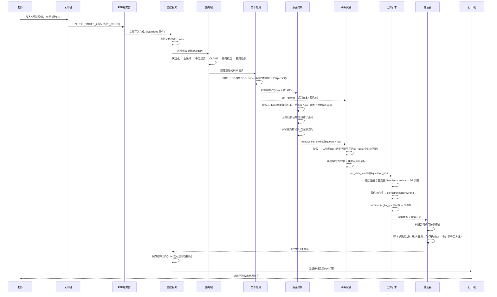

半自动批改台 - 系统架构设计

基于你已经跑通的 IV C3375 → FTP 服务器 链路，下面给出一个可直接落地的系统架构。核心原则：全自动、无人值守、低维护。

---

一、总体架构图

```mermaid
flowchart TB
    subgraph 硬件层
        A[复印机<br>IV C3375 带ADF]
        B[网络打印机<br>任意支持PDF的打印机]
    end

    subgraph 服务层 (一台常开PC或NAS)
        C[FTP服务器<br>pyftpdlib → ftp_server.py]
        D[监控服务<br>Python watchdog + 线程池队列]
        E[图像预处理<br>去噪/增强/校正/质量检查]
        F[文本检测器<br>PP-OCRv6 det model]
        G[版面分析器<br>bbox高度规则 + 手写/印刷分类]
        H[手写识别器<br>PP-OCRv6 rec model]
        I[比对引擎<br>Needleman-Wunsch DP + 置信度门控]
        J[PDF批注生成器<br>pdfplumber + reportlab + PyPDF2]
        K[按题统计汇总器]
        L[打印服务<br>subprocess 调用系统打印]
        M[任务数据库<br>SQLite]
    end

    subgraph 管理层
        N[Web管理界面<br>Streamlit 含统计/答案/复核]
        O[配置文件<br>answers.txt / config.ini]
        P[日志文件<br>便于追踪问题]
    end

    A -- 扫描到FTP --> C
    C -- 文件写入完成 --> D
    D -- 读取本地PDF --> E
    E --> F --> G --> H --> I --> K --> J
    J --> L
    L -- 打印 --> B
    D -- 记录任务 --> M
    N -- 读取/修改 --> M
    N -- 读取 --> O
    D/P --> P
```

---

二、模块划分与职责

| 模块 | 技术实现 | 职责 | 输入 | 输出 |
|------|----------|------|------|------|
| FTP服务器 | ftp_server.py (pyftpdlib) | 接收复印机上传的扫描件 | 复印机推送的PDF | 磁盘上的PDF文件 |
| 监控服务 | watchdog (本地文件事件) + 线程池队列 | 发现新PDF，触发批改流水线 | 本地 incoming 目录 | 任务ID，PDF路径 |
| 图像预处理 | core/image_processor.py (OpenCV) | 灰度化、去噪、CLAHE增强、倾斜校正、模糊检测 | 渲染后的页面图片 | 预处理后的RGB图片 |
| 文本检测器 | core/text_detector.py (PP-OCRv6 det+rec) | 阶段一：单次predict()同时检测文本区域并识别文本，返回检测框和全图识别记录 | 预处理后的图片 | 检测框列表（det_boxes）+ 全图OCR记录（ocr_records） |
| 版面分析器 | core/layout_analyzer.py (bbox高度规则) | 阶段二：布局元素分类，区分手写/印刷/拼音 | 检测框列表 + 图片高度 | 分类后的区域信息（handwriting_boxes + printed_boxes + question_regions） |
| 手写识别器 | core/handwriting_recognizer.py (bbox匹配+PP-OCRv6) | 阶段三：从全图OCR结果中通过bbox中心点匹配提取手写文本，等宽切分为单字 | 预处理后的图片 + handwriting_boxes + ocr_records | 与现有 grader 兼容的 per_char_results |
| 比对引擎 | core/grader.py (Needleman-Wunsch DP) | 逐页独立与答案做 DP 对齐，生成 correct/uncertain/wrong 状态 + 按题汇总 | 手写答案列表 + 标准答案 | 每个字的坐标/状态/置信度 + 按题统计表 |
| PDF批注生成 | core/pdf_annotator.py (pdfplumber + reportlab + PyPDF2) | 在原PDF上叠加批注图层，支持逐字模式/按题模式 | 原始PDF + 批改结果 + (可选)按题统计 | 带批注的新PDF |
| 按题统计 | core/grader.py summarize_by_question() | 按题目序号分组统计正确率，标记全部正确的题 | 批改结果 + 题目区域信息 | 按题汇总字典 |
| 打印服务 | core/printer.py (win32print) | 将带批注的PDF发送到指定打印机 | 批注PDF路径 | 打印任务 |
| 任务数据库 | SQLite + sqlalchemy | 记录每次批改任务，含可观测性指标、复核修正记录 | 批改结果 | 持久化存储 |
| Web管理界面 | Streamlit (4 tab) | 统计看板/任务列表(含详情+题统计)/答案管理/系统配置 | 用户操作 | 更新数据库、下载PDF |

---

三、核心数据流（一次完整批改）



老师仅需做三件事：放纸 → 按按钮 → 取卷子。中间全程自动化。

---

### 3.1 文件名契约（关键约定）

复印机上传的文件名是系统识别班级和任务的唯一依据，**必须事先在复印机上设定好模板**：

```
{班级}_{日期}_{序号}.pdf
```

例如：

| 文件名 | 含义 |
|--------|------|
| `301_2025-03-20_001.pdf` | 301班，3月20日，第1份 |
| `302_2025-03-20_001.pdf` | 302班，3月20日，第1份 |
| `301_2025-03-20_002.pdf` | 301班，3月20日，第2份 |

监控服务据此解析元数据并匹配对应答案。文件名与答案文件的对应关系由 Web 界面配置。

> **📌 多页 = 多学生合订**：一份 PDF 可能包含 N 页（如 11 页），每页是一个不同学生的独立答卷。
> 系统自动按页分别批改，每页独立与答案做 DP 对齐比对。
> `{序号}` 表示批号（扫描批次），不是学生编号。

---

四、技术选型明细（贴合你的技能栈）

| 领域 | 选型 | 理由 |
|------|------|------|
| FTP服务器 | ftp_server.py (pyftpdlib) | 已实现的单文件，可作为模块 import 启动，无需独立部署 |
| 监控 | watchdog 库 (监听本地文件系统) + 线程池队列 | 比轮询更实时，资源占用低，自带并发控制 |
| 图像预处理 | OpenCV (中值滤波 + CLAHE + 倾斜校正 + 模糊检测) | 提升OCR质量，手拍光照不均的补偿 |
| 文本检测 | PP-OCRv6 Medium det model (PPLCNetV4 + RepLKFPN) → text_detector.py | 高精度检测，手写体调优(det_db_thresh=0.3)，CPU可跑 |
| 版面分析 | 基于检测框 bbox 高度规则 → layout_analyzer.py | 轻量级替代 PPStructureV3，无额外模型加载，速度快 |
| 手写识别 | PP-OCRv6 Medium rec model → handwriting_recognizer.py | 50语言支持，中文手写准确率83.2%，幻觉测试93.2% |
| 比对引擎 | Needleman-Wunsch DP + 置信度门控 | 容忍插入/删除/替换错位，优于简单逐字比对 |
| PDF批注 | pdfplumber + reportlab + PyPDF2 (坐标直接比例映射) | 轻量，不依赖 pdfplumber 的图片位置解析，用其获取页面尺寸
| 打印 | win32print | 直接调用 Windows 打印，支持网络打印机 |
| 数据库 | SQLite | 单文件，零维护，适合单机部署 |
| 管理界面 | Streamlit (4 tab) | 纯Python，快速搭建，老师浏览器访问 |
| 日志 | logging 模块 (按天滚动) | 便于排查无人值守时的异常 |

---

五、目录结构设计

```
auto_marker/
├── ftp_server.py               # 复用 standalone FTP 服务器（pyftpdlib）
├── run_test.py                 # 端到端测试运行器（CLI）
├── monitor/                    # 核心监控服务
│   ├── watcher.py              # watchdog 监听本地FTP目录
│   ├── processor.py            # 流水线调度（渲染→预处理→文本检测→版面分析→手写识别→比对→批注）
│   └── config.py
├── core/                       # 批改核心
│   ├── image_processor.py      # 图像预处理（去噪/增强/校正/质量检查）
│   ├── text_detector.py        # 阶段一: 文本检测（PP-OCRv6 det model）
│   ├── layout_analyzer.py      # 阶段二: 版面分析（PPStructure布局分类+手写/印刷分离+题号检测）
│   ├── handwriting_recognizer.py # 阶段三: 手写提取与识别（PP-OCRv6 rec model）
│   ├── grader.py               # Needleman-Wunsch DP 比对 + 置信度门控 + 按题统计
│   ├── pdf_annotator.py        # 生成带批注的PDF（逐字/按题双模式）
│   ├── printer.py              # 打印模块
│   └── ocr_engine.py           # [已废弃] 旧版OCR封装，保留向后兼容，新流水线不再使用
├── db/                         # 数据层
│   ├── models.py               # SQLAlchemy定义（含可观测性字段、修正记录）
│   └── crud.py
├── web/                        # Streamlit界面
│   └── app.py                  # 4个tab: 统计看板/任务列表/答案管理/系统配置
├── data/                       # 运行时数据
│   ├── incoming/               # FTP接收目录（监控目录）
│   ├── working/                # 下载的PDF、临时文件
│   ├── output/                 # 生成的批注PDF
│   ├── backup/                 # 已处理的原始PDF归档
│   ├── failed/                 # 处理失败的PDF
│   ├── logs/                   # 日志文件
│   └── marker.db               # SQLite数据库
├── config.ini                  # 配置文件（FTP地址、答案路径等）
├── answers.txt                 # 当前批改任务的标准答案（简化）
├── requirements.txt
└── start_web.bat               # 启动管理界面
```

---

六、关键实现细节

### 6.1 图像预处理（core/image_processor.py）

对扫描页面进行质量提升，应对手拍/扫描的光照不均和轻微倾斜。

处理流水线：
1. **灰度化** — RGB → Gray
2. **低分辨率上采样** — 最小边长 < 1000px 时按比例放大到 1000px
3. **中值滤波去噪** — kernel=3，保留边缘
4. **CLAHE 对比度增强** — clipLimit=3.0（手拍光照不均更严重）
5. **倾斜校正** — 降采样到 800px 检测轮廓 → 中位数角度 → 全分辨率旋转（阈值 0.3°）
6. **模糊质量检测** — Laplacian 方差，< 60 日志警告但不阻断

### 6.2 监控服务（watcher.py）

核心设计：**线程池队列 + 文件稳定检测**，避免并发过多和读取不完整的 PDF。

```python
import os, time, logging
from concurrent.futures import ThreadPoolExecutor
from watchdog.observers import Observer
from watchdog.events import FileSystemEventHandler

logger = logging.getLogger(__name__)
executor = ThreadPoolExecutor(max_workers=4)

def _wait_for_file_stable(filepath, timeout=15, interval=0.5):
    """等待文件写入完成：大小和最后修改时间不再变化。"""
    stable_count = 0
    needed = 3
    prev_size = -1
    prev_mtime = 0
    elapsed = 0
    while elapsed < timeout:
        try:
            stat = os.stat(filepath)
            cur_size = stat.st_size
            cur_mtime = stat.st_mtime
        except FileNotFoundError:
            return False
        if cur_size == prev_size and cur_mtime == prev_mtime:
            stable_count += 1
            if stable_count >= needed:
                return True
        else:
            stable_count = 0
        prev_size, prev_mtime = cur_size, cur_mtime
        time.sleep(interval)
        elapsed += interval
    logger.warning("文件在 %ss 内未稳定: %s", timeout, filepath)
    return False

class PDFHandler(FileSystemEventHandler):
    def on_created(self, event):
        if not event.src_path.lower().endswith('.pdf'):
            return
        executor.submit(self._process, event.src_path)
    def on_modified(self, event):
        if not event.src_path.lower().endswith('.pdf'):
            return
        executor.submit(self._process, event.src_path)
    def _process(self, filepath):
        if not _wait_for_file_stable(filepath):
            return
        from monitor.processor import process_pdf
        process_pdf(filepath)

observer = Observer()
observer.schedule(PDFHandler(), path="./data/incoming", recursive=False)
observer.start()
```

### 6.3 流水线调度（processor.py）

完整流水线顺序：**渲染 → 预处理 → 文本检测 → 版面分析与分离 → 手写识别 → 比对 → 按题汇总 → 批注 → 打印 → 归档**

```python
from core.image_processor import preprocess_image
from core.text_detector import detect_text
from core.layout_analyzer import analyze_layout
from core.handwriting_recognizer import recognize_handwriting
from core.grader import grade, summarize_by_question
from core.pdf_annotator import annotate

def process_pdf(pdf_path):
    # 0. 解析文件名元数据
    path = Path(pdf_path)
    m = PATTERN.search(path.name)
    class_name, date_str, seq = m.groups()

    # 1. 加载答案（数据库优先，回退到 answers.txt）
    answers = load_answers(class_name, date_str)

    # 2. 三阶段流水线：渲染 → 预处理 → 文本检测 → 版面分析 → 手写识别
    all_results = []
    question_regions = {}
    for page_idx in range(num_pages):
        img = render_page(doc, page_idx)                # PyMuPDF 渲染 (200 DPI)
        processed_img = preprocess_image(img)           # 图像预处理
        processed_np = np.array(processed_img)

        # 阶段一：文本检测（PP-OCRv6 det model）
        det_boxes = detect_text(processed_np, page_idx)
        logger.debug(f"检测到 {len(det_boxes)} 个文本区域")

        # 阶段二：版面分析与分离（PPStructure）
        layout_result = analyze_layout(processed_np, page_idx)
        hw_boxes = layout_result["handwriting_boxes"]   # 手写区域
        logger.info(f"版面分析 → {len(hw_boxes)} 个手写区域")

        # 合并每页的 question_regions
        for pg, regions in layout_result["question_regions"].items():
            question_regions.setdefault(pg, []).extend(regions)

        # 阶段三：手写提取与识别（PP-OCRv6 rec model）
        page_results = recognize_handwriting(processed_np, hw_boxes, page_idx)
        all_results.extend(page_results)

    # 3. DP 比对（逐页独立）
    graded = []
    for page_idx in sorted(pages):
        page_graded = grade(page_answers[page_idx], answers)
        graded.extend(page_graded)

    # 4. 按题汇总
    question_summary = summarize_by_question(graded, question_regions)

    # 5. 可观测性指标
    avg_conf = mean([r["confidence"] for r in graded])
    low_conf_ratio = low_count / len(graded)
    needs_review = low_conf_ratio > 0.30

    # 6. 保存到数据库
    save_task(path, graded, avg_confidence=avg_conf, low_conf_ratio=..., ...)

    # 7. 生成批注 PDF（按题模式）
    annotated_path = annotate(str(path), graded, output_dir,
                              question_summary=question_summary)

    # 8. 打印 + 归档
    print_pdf(annotated_path)
    shutil.move(path, "./data/backup/")
```

### 6.4 答案管理

老师通过 Web 界面「答案管理」Tab 输入本次默写的标准答案，按 `(班级, 日期)` 存入数据库。

- 数据库优先：`get_answer(class_name, date_str)` 读取
- 回退到 answers.txt 文件
- API 支持增/删/改/查、显示历史版本

### 6.5 版面分析（core/layout_analyzer.py）— 核心模块

使用 PPStructure（PaddleOCR 3.7 内置）进行布局检测与元素分类，替代旧版纯 Python 行聚类方案。

**技术选型：** PP-Layout_v3 模型（PPStructure），输出12类布局元素类型，包括 `text`、`title`、`table`、`list` 等。

**子功能：**

1. **布局元素分类**
   - 调用 `PPStructure(img)` 获取页面的布局区域列表
   - 每个区域包含 `type`（布局类型）、`bbox`（边界框）、`confidence`（置信度）
   - 仅保留文本类区域（`text`、`title`、`list`、`header`、`figure_caption`）

2. **手写/印刷/拼音分离**
   - 通过 bbox 高度阈值区分（@200 DPI）：
     - `h ≥ 70px` → **handwriting**（手写答案区域）
     - `h ≤ 50px` → **pinyin_hint**（拼音提示区域）
     - 其余 → **printed_question**（印刷体题目区域）
   - 手写区域记录为 `handwriting_boxes`，供阶段三裁剪识别

3. **题号检测 `_detect_questions_from_boxes()`**
   - 从印刷体区域中按 y 排序，正则匹配 `r'[（(](\d+)[)）]|^(\d+)[.、]'`
   - 去重合并（同一题号取 y 最小的）→ 按 y 排序 → 构建 y 区间
   - 如果无文本匹配，按 y 顺序位置推断题号
   - 输出：每页的 `{q_idx, y_start, y_end, marker_bbox, marker_text}` 列表

4. **答案分配 `_assign_to_handwriting()`**
   - 手写区域的 y_center 落入对应题号区间 → 打上 `question_idx` 标记
   - 区间边界：`y_start <= center_y < y_end`（左闭右开，避免边界重叠）

**数据流：**

```
阶段一: text_detector.detect_text(img)  →  一次 predict() 同时返回:
  ├── det_boxes（检测框列表） → 阶段二: layout_analyzer.analyze_layout()
  └── ocr_records（识别记录） → 阶段三: handwriting_recognizer.recognize_handwriting()
  
阶段二: analyze_layout(det_boxes, img_h)
  ├── bbox 高度分类 → handwriting_boxes + printed_boxes
  ├── printed_boxes → 题号检测 → question_regions (y区间)
  └── handwriting_boxes + question_regions → 分配question_idx
  
阶段三: recognize_handwriting(img, handwriting_boxes, ocr_records)
  └── 通过 bbox 中心点重叠匹配 → 识别文本 → 等宽切分单字
```

**向后兼容：** 保留 `extract_student_answers()` 空壳接口，调用时发出警告提示使用新流水线。

### 6.6 文本检测器 + 手写识别器（text_detector.py + handwriting_recognizer.py）

将原 `ocr_engine.py` 的一体化 OCR 拆分为独立的检测和识别模块，并通过单次 `predict()` 调用同时获取检测和识别结果：

**文本检测器（阶段一） — text_detector.py：**
- 使用 PP-OCRv6 Medium 模型（PaddleOCR 3.7 `predict()` API）
- 一次 `predict()` 调用同时返回检测多边形（`dt_polys`）和识别结果（`rec_texts`/`rec_scores`/`rec_boxes`）
- 返回两个列表：
  - `det_boxes`（检测框）→ 用于版面分析（bbox 高度分类）
  - `ocr_records`（识别记录）→ 用于手写识别（bbox 匹配）
- 数据提取路径：`OCRResult.json['res']['dt_polys']` 和 `OCRResult.json['res']['rec_texts']`

**手写识别器（阶段三） — handwriting_recognizer.py：**
- 不再对每个手写区域独立调用 `predict()`（避免重复模型加载和子图检测失败）
- 改为从全图 OCR 结果中通过 **bbox 中心点重叠匹配** 直接提取识别文本
- 匹配规则：OCR 记录 `rec_bbox` 的中心点落在 `handwriting_bbox` 内 → 分配该识别文本
- 等宽切分整行识别结果为单字，映射回原图坐标
- 输出格式与旧版 `per_char_results` 完全兼容：
  ```python
  {
      "page": page_idx,
      "bbox_pixel": (x0, y0, x2, y2),  # 原图坐标
      "char": "春",
      "confidence": 0.92,
      "question_idx": 0,
      "img_pixel_w": 2481,
      "img_pixel_h": 3508,
  }
  ```

**性能优势：**
- 模型加载次数：1 次 vs 原来 N+1 次（1 次全图 + 每个手写区域各 1 次）
- 总识别时间从 ~77s 降至 ~40s（含模型加载）
- 避免裁剪子图尺寸过小导致检测失败的问题

**`ocr_engine.py` 已废弃**：`ocr_pdf()` 函数仍保留但不再被 `processor.py` 引用，新流水线不推荐使用。

### 6.7 比对引擎（core/grader.py）

**Needleman-Wunsch 全局对齐算法（带置信度加权）：**

- 评分矩阵：匹配 = 2 + confidence，不匹配 = -1 - confidence，空位 = -2
- 高置信度匹配获得更高分，低置信度字更容易被跳过
- 回溯得到对齐路径

**置信度门控：**

| 条件 | 状态 | 标记颜色 |
|------|------|----------|
| 字符匹配 & 置信度 ≥ 0.85 | correct | 绿色对勾 ✓ |
| 字符匹配 & 0.60 ≤ 置信度 < 0.85 | uncertain | 橙色三角 ⚠️ |
| 字符不匹配 & 置信度 < 0.60 | uncertain | 橙色三角 ⚠️ |
| 字符不匹配 & 置信度 ≥ 0.60 | wrong | 红色圆圈 ❌ |

**按题汇总 `summarize_by_question()`：**
- 按 `(page, question_idx)` 分组
- 统计每题的 total / correct / uncertain / wrong
- 标记 `all_correct`（= total>0 且全部正确）
- 携带 `marker_bbox`（题号位置，给批注器画大✓用）

### 6.8 PDF 批注生成（core/pdf_annotator.py）

**坐标映射：**
- 不依赖 pdfplumber 的 `page.images`，直接比例映射：
  ```python
  x_page = x_pixel / ocr_img_w * page.width
  y_page = page.height - (y_pixel / ocr_img_h * page.height)
  ```
- 标记大小限制为 18pt（PDF 点坐标），避免过大遮盖原字

**Qwen3-VL page_level 模式的坐标修正（在像素坐标生成前）：**
- Y 坐标 clamp：模型 y 系统性偏移（多题共享同一 y 值），用 `_clamp_chars_y_to_region()` 替换为手写框 y 范围
- X 坐标 rescale（双重触发）：模型 x 可能跨度偏大（双栏当单栏）或整体偏移（平移但跨度正常），用 `_rescale_chars_x_to_region()` 检测后线性映射到 marker_text+answer_text 推导的目标范围；偏差小时保留模型 x（保留逐字相对间距）

**两种标记模式：**

1. **逐字模式**（默认）— 每题每字独立标记：
   - 正确 → 小绿勾 ✓
   - 存疑 → 橙三角 ⚠️
   - 错误 → 红圈 ❌ + 置信度文本

2. **按题模式**（检测到题号时启用）：
   - 全对的题 → 题号右侧画大绿 ✓（大小 18pt 限制），正确字不再逐个标记
   - 有错的题 → 错误字红圈 ❌、存疑字橙三角 ⚠️，正确字不标记（减少噪音）

**绘制 API：**
```python
def annotate(original_pdf, graded_results, output_dir=None, question_summary=None):
    # use_question_mode = question_summary is not None and page_num in question_summary
    # for each result:
    #   if use_question_mode and char in all-correct question: continue
    #   elif status == "wrong": _draw_wrong_circle(can, x, y, radius, conf)
    #   elif status == "uncertain": _draw_uncertain_triangle(can, x, y, radius)
    #   else: _draw_checkmark(can, x, y, size)
    # if use_question_mode:
    #   for each all-correct question: draw big green checkmark at marker position
```

### 6.9 数据库模型（db/models.py）

**Task** 表扩展了可观测性字段：

| 字段 | 类型 | 用途 |
|------|------|------|
| id | Integer(PK) | 自增主键 |
| filename | String | 原始 PDF 文件名 |
| class_name / date_str / seq | String | 文件解析的元数据 |
| total_chars / correct_count / uncertain_count / wrong_count | Integer | 统计汇总 |
| result_json | JSON | 完整逐字批改结果（含 question_idx） |
| annotated_pdf | String | 批注后 PDF 路径 |
| avg_confidence | Float | OCR 平均置信度 |
| low_conf_ratio | Float | 低置信度字占比 |
| process_time | Float | 处理耗时（秒） |
| needs_review | Boolean | 低置信度占比 > 30% 自动标记 |
| review_done | Boolean | 教师已完成复核 |
| created_at | DateTime | 创建时间 |

**Answer** — 标准答案记录（按班级+日期存档）

**ReviewCorrection** — 人工复核修正记录，积累为微调训练集：
- task_id, char_index, original_char, original_status, corrected_char, corrected_status
- bbox_pixel, confidence（可用于训练 OCR 修正模型）

### 6.10 Web 管理界面（web/app.py）

四个 Tab：

| Tab | 内容 |
|-----|------|
| 📊 统计看板 | 汇总指标(总任务数/总字数/正确率/待复核数)、OCR 可观测性(平均置信度/低置信度占比/平均耗时)、批改结果分布柱状图、任务正确率趋势线图、按日期汇总表 |
| 📋 任务列表 | 按班级/日期/关键词筛选、任务表格(含正确率进度条)、点击查看详情(可观测性指标、每页统计表格、**每页按题统计**、逐字结果表格含状态颜色筛选、PDF下载) |
| ✏️ 答案管理 | 按班级/日期添加/编辑/删除标准答案、历史版本列表 |
| ⚙️ 系统配置 | 配置项管理 |

---

七、部署方式（针对老师）

### 7.1 最低硬件要求

· 一台常开的 Windows 电脑（4GB内存即可）
· 网络连通：与复印机同一局域网，与打印机同一网络

### 7.2 安装步骤

1. 安装 Python 3.12+ 和依赖：`pip install -r requirements.txt`
2. 首次运行 `run_test.py` 时自动下载 PaddleOCR 模型到 `model/` 目录
3. 编辑 config.ini 设置 FTP 目录、打印机名称
4. 启动 Web 界面：`streamlit run web/app.py`（访问 http://localhost:8501）
5. 在 Web 界面「答案管理」Tab 设置标准答案
6. 将测试 PDF 放入 `data/incoming/`，或直接使用 `run_test.py` 处理

### 7.3 日常使用流程

· 扫描：复印机选择"扫描到 FTP" → 自动处理 → 打印机自动输出批改好的卷子
· 测试：`python run_test.py -p <文件名>.pdf -c <班级> -d <日期>`
· 预置答案：`python run_test.py --seed-answers "春眠不觉晓..."`

---

八、异常处理与维护策略（几乎不用维护）

| 异常场景 | 处理方式 | 用户感知 |
|----------|----------|----------|
| 复印机未开机 / 网络断开 | 监控服务持续重试，日志记录错误 | 检查网络后自动恢复 |
| 答案未设置 | 流水线跳过，日志警告 | Web界面提示"缺少答案" |
| OCR 识别失败（空白页） | 在 processor.py 中判定 `not all_ocr_results`，移入 failed 目录 | 日志记录 |
| 打印机缺纸 | 打印服务超时，记录错误 | Web界面可重新打印 |
| 磁盘空间不足 | 监控服务停止处理，日志告警 | 清理 data/backup 后恢复 |
| 文件写入未完成 | watchdog 文件稳定检测超时则跳过 | 日志记录 |
| 低置信度字过多 | `needs_review=True` 标记到数据库 | Web界面提示"需人工复核" |

其他关键设计：
- **并发控制**：`ThreadPoolExecutor(max_workers=4)` 限制同时处理任务数
- **文件锁**：通过稳定检测（尺寸/时间戳连续3次不变）替代文件锁
- **归档**：处理完成的 PDF 移入 backup，失败的移入 failed

---

九、性能预估

| 指标 | 数值 | 说明 |
|------|------|------|
| 单页OCR时间 | 1-2秒 | PP-OCRv6 Medium，CPU i5-8250U |
| 图像预处理 | 0.3-0.5秒/页 | CLAHE + 倾斜校正降采样 |
| 版面分析 | <0.1秒/页 | 纯Python行聚类+正则匹配 |
| 单页全流程 | 2-3秒 | 含渲染+预处理+OCR+比对+批注 |
| 90页处理总时间 | 3-5分钟 | 不含打印 |
| 数据库占用 | <10MB | 存储1000次任务 |

---

十、未来扩展方向

1. **多班级/多答案库**：升级为Web版，支持老师账号、云端同步
2. **高级批改**：接入本地 LLM（Qwen）识别形近字错误（如"未/末"）
3. **学情分析报告**：自动生成班级错题排行榜、每个学生的易错字
4. **与微信/钉钉集成**：批改完成后自动推送消息给老师
5. **按题标注数据积累**：ReviewCorrection 表积累人工修正数据，可用于微调 OCR 模型
6. **双栏试卷支持**：当前 y-only 区域划分无法处理双栏布局，需引入 x 坐标列检测